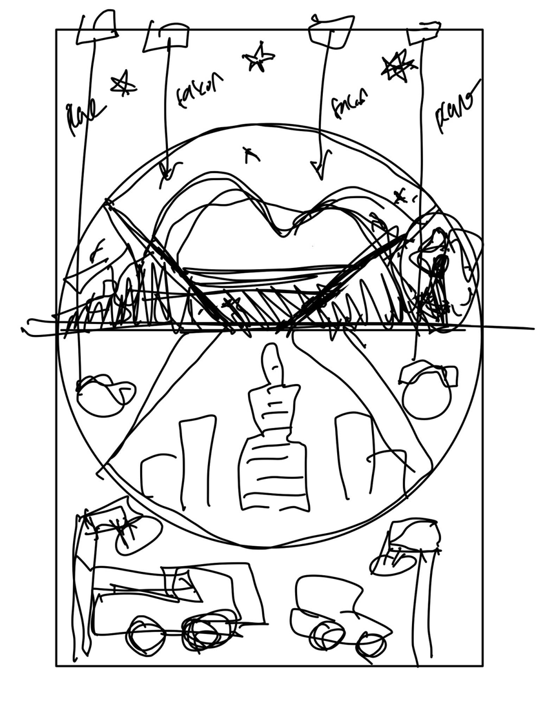

# hourglass

### [Ideation + Laser Cut Experiment | April 6, 2023 ](https://github.com/gauthamdk/hourglass/tree/main/ideation)

# Core Idea
The core concept of our project is to illustrate the flow of time in the U.A.E. using the flow of sand. The project will occupy two boxes, 100cm long and 50cm wide, vertically oriented. A flat hourglass will be placed between the two boxes at the center of the piece, and will rotate at the beginning of every hour. The placement of the hourglass will be exactly at the center of the piece, 25cm below the top and 25cm above the bottom. Another layer of lasercutted acrylic will conceal the hour glass from viewers, only showing certain parts of the flowing sand. The contents of the acrylic board is detailed below. 

# Design Details
The flow of time will be portrayed through the artistic cutouts of the acrylic board, covering the entire span of the two wooden boxes. The design of the top half of the board will portary the U.A.E. of the past, and the bottom half will show the U.A.E. today. If the piece is split into four sections from top to bottom, the flow of sand will be shown in the 2/4 and 3/4 section, and the 1/4 and 4/4 sections will be decorational and supplemental. 

## The 1/4 Section
In this section, we will have cutouts of stars and the Sun on the acrylic board. White light will be placed behind the stars, and an orange/red light will be placed behind the Sun. When the 2/4 section (old U.A.E.) is full of sand, the Sun's light will be on full brightness, and the stars' lights will be the most dim. As sand flows from the 2/4 section to the 3/4 section (new U.A.E.), the Sun's light will progressively get dimmer and the stars' lights brighter. When 2/4 has no sand left, the stars will be on full brightness and the Sun will have no light. 

The goal of section 1/4 is to demonstrate old U.A.E. fading with time, with the Sun metaphorically setting as night time comes. 

## The 2/4 Section
This section will portray sand dunes, camels, and the inhabitants of the U.A.E. decades ago. In the fan shaped window where the sand from the hourglass is visible, the acrylic board will be fully hollow. For example, the sand dunes will be hollow, allowing the actual sand from the hourglass to providing the fillings of the cutouts. The sections of 2/4 that does not have the hourglass behind it will still continue the image of the sand dune, but will be laser etched instead of cut. These are the places that the camels and inhabitants will be placed. 

## The 3/4 Section
This section will portray the new U.A.E., mirroring section 2/4 in terms of its layout. The parts that have the hourglass behind it will be hollow, portraying iconic buildings of the U.A.E such as the grand mosque and the Burj Khalifa. The parts that do not have the hourglass behind will be etched instead, displaying Etihad and Emirates airplanes. 

## The 4/4 Section
This section will be complimentary to section 3/4, with cars and street lights etched and cut into the board. The body of the cars will likely be cut, and the wheels of the cars will be hollow, with actual mini-wheels protruding from the surface. The body of the street lights will be etched, with the actual light bulbs hollow. LED lights will be placed behind these light bulbs. As sand flows from section 2/4 to 3/4, the wheels of the cars will go from static to fully spinning, and the street lights will go from dim to full brightness. 
