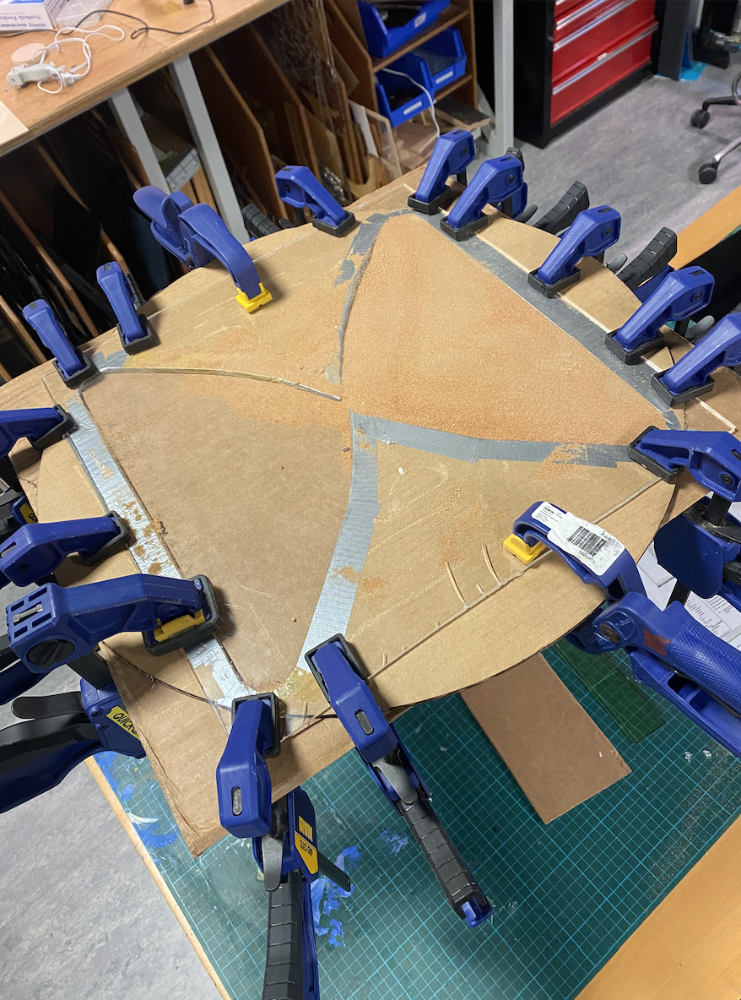
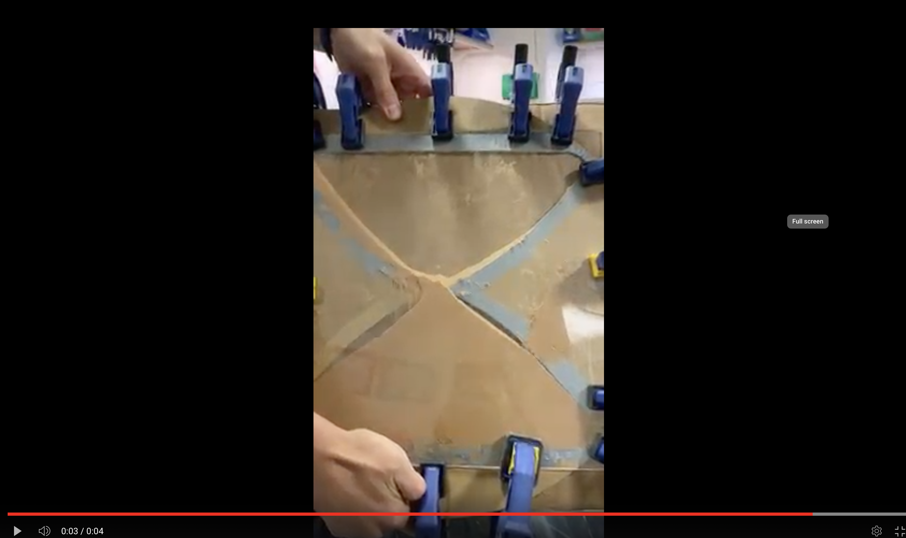
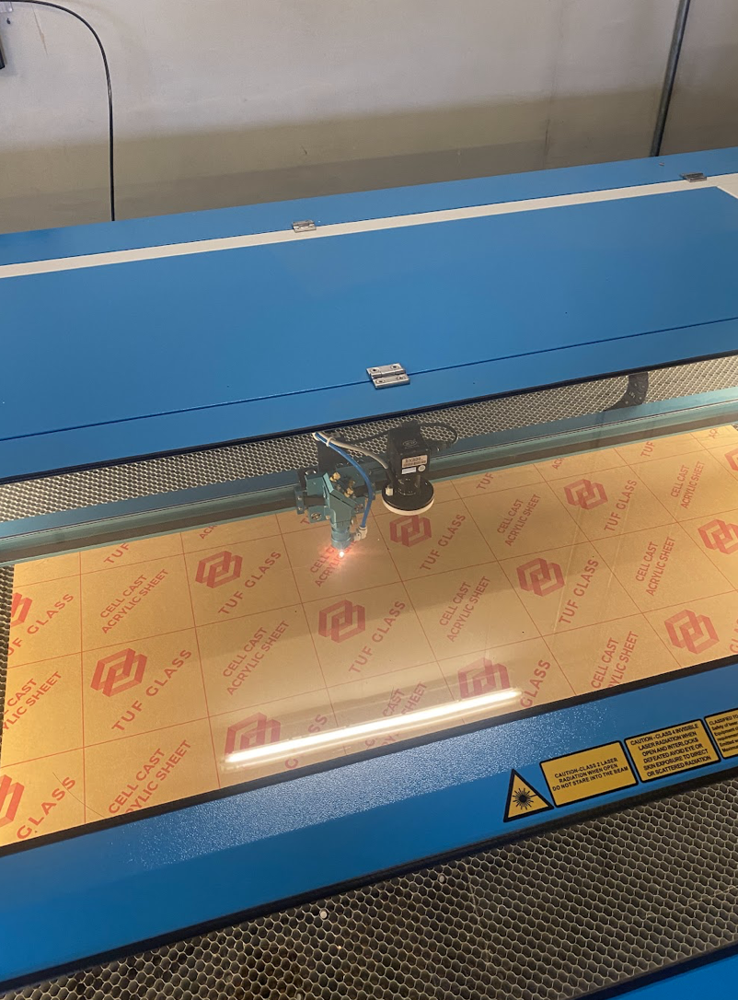
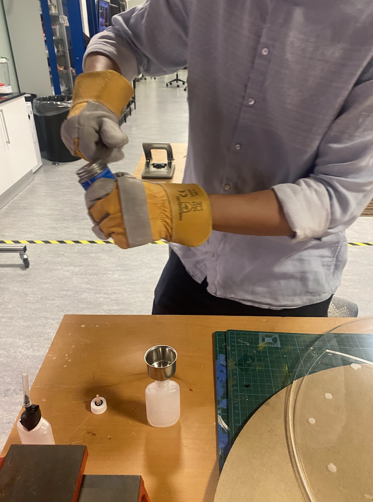
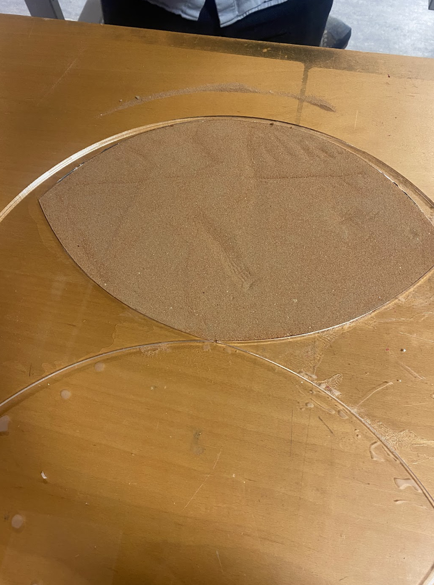
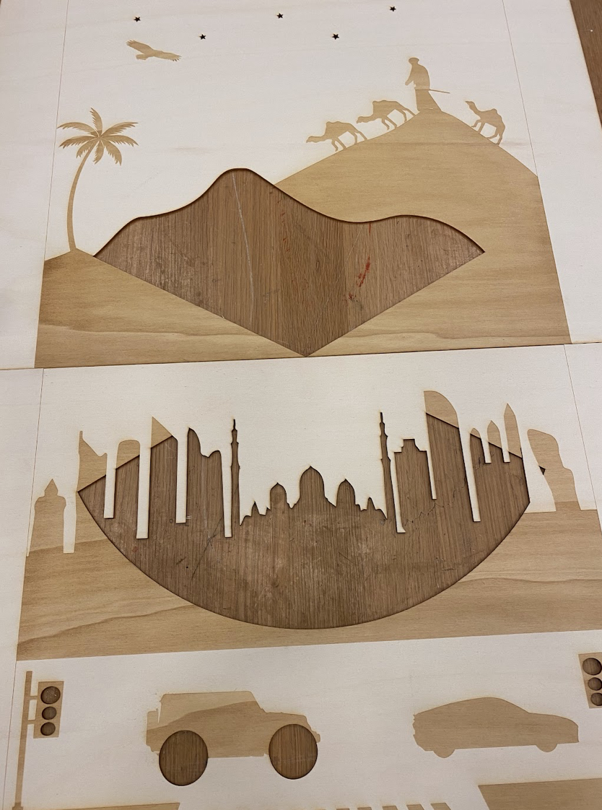
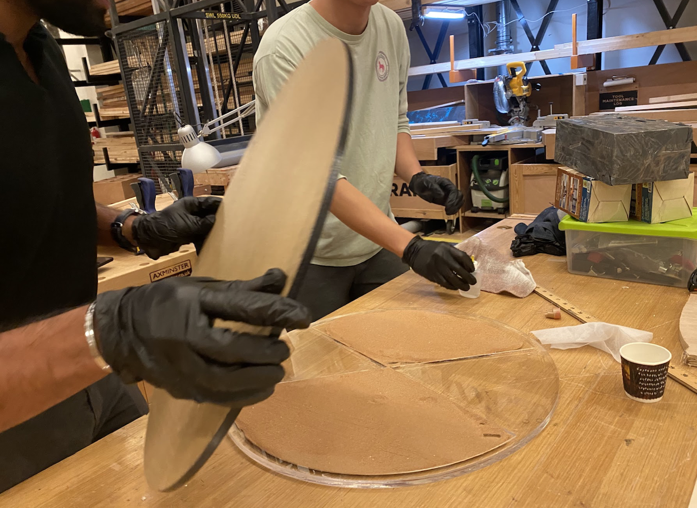

# April 10th
In this class session, we divided our work into hourglass prototyping and illustrator designing. Nathan mainly worked on the hourglass prototype, and Gautham and Soojin were designing the acrylic cutouts. 

## Hourglass prototype
Due to a lack of acrylic material, we decided to use cardboard to simulate an acrylic hourglass. In the previous class, we had breifly lasercut a cardboard hourglass, and that was the hourglass we worked with in this prototype. The main difference between cardboard and acrylic for our project was that we had to address the holes on the side of the cardboards, which we simly taped up. Here is the cardboard hourglass:

    

Next, we glued the cardboard hourglass to a flat cardboard surface, and then started filling in the hourglass with sand. Since we want the sand from the hourglass to provide a solid filling for the plywood cutout in the front, the sand needed to perfectly fill in half of the hourglass. After some trial and error, the sand filling was completed, and we moved onto gluing a transparent acrylic board onto the sand-filled hourglass. This proved to be the hardest part of the prototype, as the acrylic board was heavy and hard to glue seamlessly onto the uneven cardboard surface. We tried glue guns, white glue, and acrylic glue, but none of the options worked. In the end, since the hourglass was only a prototype to test the flow rate, we decided to just use clamps to hold down all sides of the acrylic board. The prototype looked like this:

    

Even with using as many clamps as we did, the sand was still leaking from the sides, as well as going around the hourglass as it flowed down into the bottom. However, most of the sand flowed decently through the hole of the hourglass, and we were able to find out that a 5mm hole is much too big. The total flow time did not even last five seconds. Overall, this prototyping session was very helpful for us in getting a rough estimate of the hourglass dimensions. Here are some videos of the prototype: 

[Test 1](images/sand_cardboard_porrotype.MOV)
[Test 2](images/sand_cardboard_2.MOV)
[Test 3](images/sand_cardboard_3.MOV)

# April 12th
Gautham and Soojin finalized their illustrator work from April 10th, and plan to lasercut their design on April 13th. Here is the current design:

    

The black circle in the middle is the area where the hourglass will rotate. The thick black strokes are all areas that will be laser etched into the plywood surface, and the think pink lines will be the places where the plywood is laser cut. There are three sections of these laser cuts, including the sand dune at the top, the U.A.E. skyline, and the wheels of the jeep underneath the skyline. 

# April 17th
During this class, we focused on prototyping and testing our laser cutting design.

## Prototyping
### Motor
Nathan and Soojin worked primarily on the prototyping process. Soojin focused on testing the hourglass, while Nathan worked on testing the motor. For the motor testing, our primary concern was the capability of the servo motor in handling the weight of the piece. We used a piece of plywood that was similar in weight to the final hourglass, bolted the servo motor onto the wood, and tested its turning ability. Despite Nathan eyeballing its centering on the wood, we found no concerns regarding the motor's capabilities for the final piece.

It's important to note that we originally designed a structure that would secure the motor to the hourglass. However, after realizing that the motor had its own securing mechanisms, we no longer believe that we need any additional mechanisms to secure the motor to the hourglass. Please see the photos and videos of the motor prototyping process below.

    
    
    

MOTOR PICS AND VIDS

### Hourglass
Soojin led the hourglass testing. For hourglass testing, our aim was to understand the behavior of sand moving from one side to the other on a thin, ribbon-shaped surface in our design. Based on the speed of the sand movement, our next step is to identify the size of the hole that connects the two sections.

For the prototype, we used acrylic as the cover, cardboard as the hourglass-shaped cutout, and another cardboard as the supporting board. The cardboards were sealed with duct tape to prevent sand from entering the corrugated space. We then clamped the three layers together to ensure enough pressure and a tight seal. Since the materials used were not consistent, such as three acrylic layers or three cardboard layers, it was difficult to "glue" them, which is why we used clamps for the experiment.

<b>Video of sand moving below:</b>

As expected, the sand moved quickly through the hole, taking only 4 seconds to move from one side to the other. However, to achieve the desired speed of 15-20 minutes for sand to move from one place to another, we decided to try using 0.05cm for the next prototype.

[Things to consider]

- Color of sand (considering the plywood background, what color sand would be impactful?)
- Which material to use to glue acrylic to plywood
- Thickness of Acrylic
- Make hole size adjustable using nuts and bolts

## Laser Cutting
Gautham led the laser cut design testing process. The cardboard result looked great, but the laser cutting machine in the IM lab was not large enough for the full scale of our project. Therefore, we scaled down the design just to test it out. Here is how it turned out:

    
    

The initial result had some errors, such as the sand dune not being cut out and the skyline on the bottom being proportionally smaller than the sand dunes. To fix these issues, we decided to make the skyline bigger in our next design and change the skyline from Dubai to Abu Dhabi, where the building heights are more even. Additionally, we were not happy with the star design, so we changed them to actual star shapes in the second design. Please see the second design below.

# April 24th

    
    

In this class, we primrily tested out our hourglass design with actual transparent acrylic. We went to the machine lab and cut out the design with the large laser cutter, then used acrylic glue to merge the layers of the hourglass. The main issue in this step is that there are three layers of the hourglass, which makes the last layer very hard to glue. We have to trace the hourglass ledges with the glue, then blindly place the final layer on top. We did not succeed in gluing the last layer until the next day. Here is the end result:

There were a few isues. One, the last layer was not completely sealed to the rest due to the difficulty in gluing. For the final design, we will put more glue. There was also any issue of the sand getting blocked due to small rocks sealing the hourglass gap. We will sort through the batch of sand we use for the final design. Finally, the sand did not fully flow through, mainly becuase the bottom ledge of each half are curved. Small amounts of sand were tracked in the two pockets and would not flow freely. To remedy this issue, we have made the curved ledges straight. 

# April 28th

After encountering some trial and error with the first acrylic cut, we made a second cut. This time, we made the hole between the top and bottom of the hourglass much smaller (0.3cm) and straightened the curve to ensure that the sand flows smoothly without getting stuck. We also redesigned and laser cut the plywood board so that its line is aligned with the new straight line of the hourglass acrylic board.

Finding the exact amount of sand to add before sealing the hourglass was difficult. Therefore, we added more than half of the sand, and then drilled a hole in the center to pour out any excess sand once the bottom is filled.

# April 30th

# May 1st 
Car Wheel 3-D print. 

# May 5th
We secured the frame structurally today, including implementing a floor, two supporting boards on the side, and a board in between. The "H" structure adequately secures the integrity of the frame.

We spray painted the car wheel and attached to the main plywood board. 

# May 7th 
We did some soldering for the connections on the design frame, including the soldering for the star light connections. We also drilled some holes into the board that will ultimately host all the wires and arduinos in order to provide space for the wires. 

# May 8th
We finalized assembling the project, including replacing all of the jumper wire connections with solder and attached the design frame to the project frame. The mechanisms did not work initially after we soldered everything, including the stars, traffic lights, and hourglass. However, after some testing with the multimeter, the professor helped us trouble shoot the issue and tidy up the connections. 
